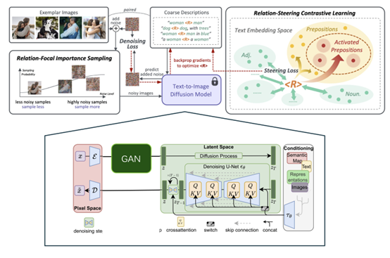

# ECE449 Final Project: Enhancing ReVersion Model under Few-shot Scenarios

This repository is built upon the following paper:
> **ReVersion: Diffusion-Based Relation Inversion from Images**<br>
> [Ziqi Huang](https://ziqihuangg.github.io/)<sup>∗</sup>, [Tianxing Wu](https://tianxingwu.github.io/)<sup>∗</sup>, [Yuming Jiang](https://yumingj.github.io/), [Kelvin C.K. Chan](https://ckkelvinchan.github.io/), [Ziwei Liu](https://liuziwei7.github.io/)<br>

From [MMLab@NTU](https://www.mmlab-ntu.com/) affiliated with S-Lab, Nanyang Technological University

You can also find the original project at <!--  -->
[](https://ziqihuangg.github.io/projects/reversion.html)


<!-- [[Paper](https://arxiv.org/abs/2303.13495)] | -->
<!-- [[Original Project Page](https://ziqihuangg.github.io/projects/reversion.html)] | -->
<!-- [[Video](https://www.youtube.com/watch?v=pkal3yjyyKQ)] |  -->
<!-- [[Dataset](https://drive.google.com/drive/folders/1FU1Ni-oDpxQCNYKo-ZLEfSGqO-j_Hw7X?usp=sharing)]  -->
<!-- [[Huggingface Demo](https://huggingface.co/spaces/Ziqi/ReVersion)] | -->


## :open_book: Overview


In this project, we focus on the concept of few-shot relation personalization. We are provided with several reference pictures, and these reference pictures all share a common underlying relation. The key objective is to generate new images where the objects within them interact in accordance with this shared relation. 

We started from the **ReVersion** model as baseline. When running the **ReVersion** model, we found that although the model can generate diverse images with constant relationship between entities, it would generate strange or constant entities if the training samples are reduced. Therefore, we leveraged LLM and GAN to enhance the model's few-shot ability.

See `report` for more details.

## :hammer: Installation

The are no extra dependencies other than the ones in the original project.

1. Clone Repo

   ```bash
   git clone https://github.com/ziqihuangg/ReVersion
   cd ReVersion
   ```

2. Create Conda Environment and Install Dependencies

   ```bash
   conda create -n reversion
   conda activate reversion
   conda install python=3.8 pytorch==1.11.0 torchvision==0.12.0 cudatoolkit=11.3 -c pytorch
   pip install diffusers["torch"]
   pip install -r requirements.txt
   ```

## :heart: Acknowledgement   

This project is built using the following open source repositories:
- [Stable Diffusion 1.5](https://huggingface.co/runwayml/stable-diffusion-v1-5)
- [Diffusers](https://github.com/huggingface/diffusers)
